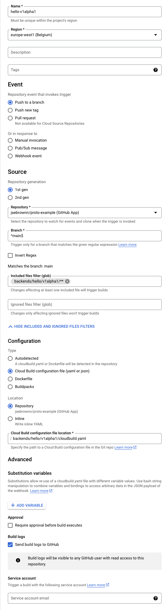

# Proto Example
This repository contains some basic sample code to illustrate the use of protobufs in setting up gRPC servers in Go, 
running on Google Cloud Run. It also contains some useful workflows and CI/CD pipelines to help you get started with
your own projects.

## Setting up Secrets for Buf related Github actions
1. Create an account at [buf.build](https://buf.build)
2. Navigate to settings by clicking on your profile in the top right corner.
3. Create a new token name "Github Actions" and copy the value.
4. In your repo settings, navigate to "Secrets and variables" > "Actions" and select "New repository secret"
5. Create a secret with name "BUF_API_TOKEN" and paste the value of your token.
6. Add another secret with name "BUF_USER" and provide your buf username.

## Setting up repository to be able to publish to Github Packages
1. Navigate to the repository settings and select "Actions" > "General"
2. Under Workflow permissions, select "Read and write permissions"
3. Save the changes

## Configuring Google Cloud Build to build and deploy backend services to Cloud Run
1. Create a Docker repository in Artifact Registry for storing your images for backend services. I have
called this "services-artifacts"
2. Setup a build trigger in Cloud Build to listen for changes to the backends, and build and deploy accordingly
in line with the cloudbuild.yaml for the service. To do so, we must also connect our github repository to Cloud Build.
   1. Navigate to Cloud Build > Triggers and select "Connect Repository". Follow the instructions to connect the repository of interest.
   2. Then select "Create Rigger" and create a trigger similar to the following:

3. Upon pushing changes to our hello-v1alpha1 backend, this trigger will automatically kick of the building and deploying of our service to cloud run
4. TODO: you can set up your build triggers in different Google Projects to listen to specific branches. For example, a Production deployment that 
listens to the "main" branch, and a Development deployment that listens to the "dev" branch. This is useful for testing out changes before deploying to production.